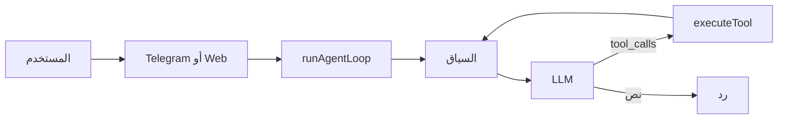

# Jarvis — دليل المشروع (العربية)

مساعد ذكاء اصطناعي شخصي على جهازك: **Telegram** (يعمل دائمًا) و**واجهة ويب** محلية اختيارية. **واجهة الويب تستخدم نماذج محلية فقط** (Ollama / متوافق مع OpenAI). عبر Telegram يمكن تشغيل **محلي** أو **سحابي** (Groq/Gemini) أو **تلقائي** بأمر **`/engine`**. **Groq** و**Gemini** اختياريان لوضع API؛ **ذاكرة SQLite** واختياري **Firebase**، **ملف المستخدم** (`data/user-profile.json`)، **توجيه حسب النية (intent)**، و**أدوات** متعددة (طرفية، ملفات، متصفح، Google، توليد صور/فيديو، وغيرها).

| المستند | اللغة |
|---------|--------|
| [README.md](./README.md) | English (full guide) |
| **هذا الملف** | العربية |
| [JARVIS_INDEX.md](./JARVIS_INDEX.md) | فهرس المسارات والملفات |

---

## جدول المحتويات

1. [ما الذي يفعله المشروع؟](#ما-الذي-يفعله-المشروع)  
2. [المتطلبات](#المتطلبات)  
3. [بدء سريع والتحقق أن التشغيل يعمل](#بدء-سريع-والتحقق-أن-التشغيل-يعمل)  
4. [الإعداد (Configuration)](#الإعداد-configuration)  
5. [تشغيل المشروع](#تشغيل-المشروع)  
6. [ملفا المسارات `paths.json` و `more_paths.json`](#ملفا-المسارات-pathsjson-و-more_pathsjson)  
7. [أوامر البوت في Telegram](#أوامر-البوت-في-telegram)  
8. [واجهة الويب](#واجهة-الويب)  
9. [التدفق من البداية للنهاية](#التدفق-من-البداية-للنهاية)  
10. [توجيه الـ LLM](#توجيه-ال-llm)  
11. [طبقة ذكاء JARVIS](#طبقة-ذكاء-jarvis)  
12. [حلقة الوكيل والأوضاع](#حلقة-الوكيل-والأوضاع)  
13. [الذاكرة: SQLite وFirebase](#الذاكرة-sqlite-وفirebase)  
14. [ربط Google (OAuth)](#ربط-google-oauth)  
15. [قائمة الأدوات](#قائمة-الأدوات)  
16. [الأمان والمخاطر](#الأمان-والمخاطر)  
17. [Docker و PM2 والنشر](#docker-و-pm2-والنشر)  
18. [إضافة أداة جديدة](#إضافة-أداة-جديدة)  
19. [استكشاف الأعطال (موسّع)](#استكشاف-الأعطال-موسّع)  
20. [المكدس التقني](#المكدس-التقني)  

---

## الفهرس الأم

راجع **[`JARVIS_INDEX.md`](./JARVIS_INDEX.md)** لخريطة الملفات والمسارات. عند نقل مجلد أو تغيير اسم ملف، حدّث `paths.json` و`more_paths.json` و`JARVIS_INDEX.md` معًا.

---

## ما الذي يفعله المشروع؟

- يستقبل رسائلك من Telegram (نص، أو **صوت** يُحوَّل لنص عبر **Groq Whisper** عند ضبط **`GROQ_API_KEY`**).
- يبني سياقًا من **آخر رسائل المحادثة**، **مقتطفات ذاكرة مُسترجَاة**، و**ملف المستخدم**؛ **النية (intent)** توجّه التخطيط والنبرة.
- يرسل الرسائل للنموذج مع **قائمة أدوات**؛ النموذج يجيب مباشرة أو **يستدعي أدوات** (أوامر، ملفات، متصفح، Google، إلخ).
- يكرر حتى إجابة نهائية أو حد **`MAX_AGENT_ITERATIONS`**.
- خادم ويب اختياري: محادثة عبر **WebSocket** مع **حالة وكيل حية** (`thinking`، `planning`، `executing`، `verifying`، `done`)، رفع ملفات، ربط Google، إعدادات. **محادثة الويب لا تستخدم نماذج سحابية** (محلي فقط، `forbidApiFallback`).

**ملاحظة مهمة:** التشغيل العادي يشغّل **بوت Telegram دائمًا**. إذا أضفت `--web` يعمل **Telegram + الويب معًا**، وليس الويب بدل Telegram.

---

## المتطلبات

- **Node.js 20+** (حقل `engines` في `package.json`).
- بوت Telegram من BotFather.
- **`LOCAL_OPENAI_BASE_URL`** (مثل Ollama `http://127.0.0.1:11434/v1`) لـ **واجهة الويب** ولـ Telegram عند استخدام **محلي** أو **تلقائي** مع خادم محلي يعمل.
- **`GROQ_API_KEY`** (اختياري لبوت **محلي بالكامل**؛ **مطلوب لصوت Telegram** عبر Whisper).
- **`GEMINI_API_KEY`** (اختياري؛ إن وُجد وصالح يُستخدم Gemini في وضع محرك **API** عند اختياره).
- على Windows: بعض الأدوات مرتبطة بنظام ويندوز؛ داخل Docker/Linux قد تختلف السلوكيات أو لا تتوفر.

---

## بدء سريع والتحقق أن التشغيل يعمل

### 1) التثبيت والمجلد الصحيح

```bash
cd D:\AI\jarvis
npm install
```

يجب أن تكون داخل المجلد الذي يحتوي **`package.json`** و**`paths.json`** و**`more_paths.json`**.

### 2) البيئة

```bash
copy .env.example .env
```

عبّئ على الأقل:

- `TELEGRAM_BOT_TOKEN`
- `LOCAL_OPENAI_BASE_URL` — إن استخدمت الويب أو التوجيه المحلي في Telegram
- `GROQ_API_KEY` — إن استخدمت **صوت Telegram** أو **`/engine api`**
- **`ALLOWED_USER_IDS`** — معرفك الرقمي في Telegram (مفصول بفواصل لعدة مستخدمين). **إن تركتها فارغة يقبل البوت الجميع** (للتجربة فقط).

### 3) مجلد `tokens/`

ضع ملفات OAuth وFirebase بالأسماء القصيرة (انظر `more_paths.json`):

| الملف | الغرض |
|--------|--------|
| `tokens/google-oauth.json` | عميل Google OAuth (`installed` أو `web`) |
| `tokens/google-token.json` | يُنشأ بعد تدفق OAuth |
| `tokens/firebase.json` | حساب خدمة Firebase (اختياري) |
| `tokens/google-oauth-alt.json` | عميل OAuth ثانٍ (اختياري) |

### 4) تشغيل التطوير

```bash
npm run dev
```

### علامات نجاح التشغيل

```text
[telegram] Starting long polling...
[telegram] Online.
```

**تم التحقق عمليًا** على Windows من جذر المستودع: `npx tsx src/index.ts` يحمّل الأدوات، يفتح قاعدة البيانات، ثم **`[telegram] Online.`**

إذا كان عندك «لا يعمل»، غالبًا أحد أسباب [استكشاف الأعطال](#استكشاف-الأعطال-موسّع) أدناه.

### 5) ويندوز — ملفات التشغيل في **`run/`**

| الملف | الوظيفة |
|--------|---------|
| **`run/dev.bat`** | `npx tsx src/index.ts` من جذر المشروع (Telegram فقط) |
| **`run/web.bat`** | بناء ثم `node dist/index.js --web` وفتح المتصفح |
| **`run/pm2.bat`** | بناء ثم PM2 في الخلفية |
| **`run/stop-pm2.bat`** | `pm2 stop jarvis` قبل التطوير إن كان PM2 يشغّل نفس البوت |
| **`dev.bat` / `web.bat` / `pm2.bat`** في الجذر | نفس الوظائف دون الدخول إلى `run/` |

**لا تشغّل PM2 و`npm run dev` معًا** لنفس توكن البوت — سيظهر **409 Conflict**. اقرأ **`run/README.txt`**.

---

## الإعداد (Configuration)

### إلزامي (من `config.ts`)

- `TELEGRAM_BOT_TOKEN`

### موصى به بشدة

- `LOCAL_OPENAI_BASE_URL` — Ollama أو نقطة نهاية متوافقة مع OpenAI (الويب + التوجيه المحلي)
- `GROQ_API_KEY` — Whisper (صوت) ونماذج سحابية عند **`/engine api`**

### متغيرات اختيارية شائعة

- `ALLOWED_USER_IDS` — قائمة بيضاء (فارغ = بوت مفتوح)
- `DB_PATH` — ملف SQLite (الافتراضي من `paths.json`، عادة `data/memory.db`)
- `GEMINI_API_KEY`, `GROQ_MODEL`, `GEMINI_MODEL`
- `GOOGLE_CREDENTIALS_PATH`, `GOOGLE_TOKEN_PATH`
- `FIREBASE_PROJECT_ID`, `FIREBASE_SERVICE_ACCOUNT_PATH`
- `WEB_PORT`, `WEB_HOST`
- `LOCAL_OPENAI_API_KEY`, `LOCAL_LLM_MODELS`
- **وسوم نماذج محلية (مهمة / نية):** `LOCAL_MODEL_REASONING` (افتراضي `qwen2.5:7b`)، `LOCAL_MODEL_CODING` (`qwen2.5-coder:7b`)، `LOCAL_MODEL_FAST` (`llama3.1:8b`)، `LOCAL_MODEL_AUTOMATION` (افتراضيًا نفس المبرمج)، `LOCAL_INTENT_MODEL` (اختياري؛ افتراضيًا نموذج التفكير لتحسين النية)
- `INTENT_CONFIDENCE_THRESHOLD` — افتراضي `0.55`؛ دون ذلك (أو تعقيد عالٍ / `needs_tools`) يُفعّل استدعاء محلي لتحسين النية
- `MAX_AGENT_ITERATIONS`
- `DEFAULT_LLM_PROVIDER`, `DEFAULT_LLM_MODEL`, `DEFAULT_DEEP_SEARCH`, `DEFAULT_THINKING`, `DEFAULT_ASSIST_ONLY`

**ملف المستخدم:** عند أول تشغيل يُنشأ `data/user-profile.json` (من `src/memory/user-profile.json`). عدّل الاسم والتفضيلات والاهتمامات؛ قد تُضاف أسطر **مُتعلَّمة** إلى `behavior_patterns` عند تكرار التأملات.

راجع **`.env.example`** للتعليقات.

**Firebase:** حقول مثل `project_id` و`client_email` داخل `tokens/firebase.json` **يجب أن تطابق** مشروع Google الفعلي.

---

## تشغيل المشروع

```bash
npm run dev          # Telegram فقط (tsx)
npm run dev:web      # Telegram + ويب
npm run build
npm start            # Telegram فقط (JS مُجمَّع)
npm run start:web    # Telegram + ويب
npm run start:bg     # PM2: ecosystem.config.cjs
```

**PM2** اسم التطبيق: **`jarvis`** → `pm2 logs jarvis`

**Docker:** من الجذر:

```bash
docker compose up -d --build
```

أمر الحاوية الافتراضي **بدون** `--web` ما لم تغيّر `CMD` في `Dockerfile`.

---

## ملفا المسارات `paths.json` و `more_paths.json`

- **`paths.json`** — المجلدات الرئيسية (`tokens`، `data`، `uploads`، `logs`) ومسار قاعدة البيانات الافتراضي.
- **`more_paths.json`** — مسارات Google OAuth، ملف Firebase، OAuth بديل، تلميحات الويب/العامة.

يحمّلهما التطبيق من **`src/project-paths.ts`** و**`ensureProjectDirs()`** ينشئ المجلدات الناقصة عند الإقلاع. **حدّث الملفين عند نقل المسارات** بدل تثبيت مسارات في الكود.

---

## أوامر البوت في Telegram

| الأمر | الوظيفة |
|--------|---------|
| `/start` | ترحيب، حالة Google، مساعدة |
| `/engine` | `local` / `api` / `auto` — **السحابة فقط عند `api`**؛ `auto` يفضّل المحلي إن كان Ollama يعمل |
| `/model` | عرض أو تعيين **نموذج Ollama المثبّت** (يتجاوز التوجيه التلقائي حسب المهمة عند التعيين) |
| `/mode` | عرض المحرك، النموذج المحلي، وضع عدم الاتصال، الاتصال |
| `/offline` | تبديل وضع عدم الاتصال (إزالة أدوات تحتاج إنترنت) |
| `/tools` | أسماء الأدوات المسجّلة |
| `/google_auth` | OAuth (المتصفح → `http://localhost:49152/callback`) |
| `/clear` | مسح المحادثة لهذا المحادثة |
| `/ping` | `Pong.` |
| `/id` | معرف المستخدم لـ `ALLOWED_USER_IDS` |

---

## واجهة الويب

- افتح `http://WEB_HOST:WEB_PORT` (افتراضيًا `http://localhost:3000`) بعد `dev:web` أو `start:web`.
- **نماذج محلية فقط** — المحادثة لا تستخدم Groq/Gemini حتى لو ضُبط `/engine api` في قاعدة البيانات؛ عند الفشل يظهر `JARVIS_LOCAL_LLM_FAILED` (مع رد محلي مُبسّط عند الإمكان).
- مثال حمولة WebSocket للمحادثة: `{ "type": "chat", "text": "...", "deepSearch": true, "thinking": true, "assistOnly": false, "files": [...] }`
- **`{ "type": "cancel" }`** يلغي الطلب الجاري.
- **أحداث حالة الوكيل:** `{ "type": "agent_state", "chatId", "state", "step"?, "tool"?, "verifyTarget"? }` لتقدّم مباشر (thinking → planning → executing → verifying → done).

**تحذير:** الويب **لا** يكرر قائمة المسموح بهم في Telegram. لا تفتح المنفذ على الإنترنت دون بروكسي عكسي ومصادقة.

---

## التدفق من البداية للنهاية

1. بدء العملية → `ensureProjectDirs()` → `initDatabase()` (SQLite + Firebase اختياري).
2. تسجيل الأدوات عبر `src/tools/index.ts` → `registry.ts`.
3. بدء Telegram long polling (وخادم HTTP إن `--web`).
4. رسالة المستخدم → تحقق الصلاحية → اختياريًا تحويل صوت → **`runAgentLoop`**.
5. الحلقة تصنّف **النية** (جمع بين قواعد ونموذج محلي JSON عند الحاجة)، تحل **مسار الـ LLM**، تُدخل **الملف الشخصي + مقتطفات الذاكرة المرتبة**، تستدعي الـ LLM، تنفّذ **استدعاءات أدوات** حتى الانتهاء أو بلوغ الحد؛ اختياريًا **تأمل** و**مراجعة داخلية** كل **10** تفاعلات مكتملة.
6. إرسال الرد إلى Telegram/الويب مع وسائط عند عودة الأدوات بملفات.

---

## توجيه الـ LLM

- **واجهة الويب:** دائمًا **`provider: local`** مع اختيار **نموذج** حسب المهمة/النية (ما لم يثبّت المستخدم نموذجًا عبر Telegram **`/model`** في الإعدادات).
- **Telegram `engine local` أو `offline`:** مزود محلي فقط؛ **لا تراجع سحابي** إلا إذا **`engine api`** (ومتصل).
- **Telegram `engine api`:** **Gemini** أولًا إن المفتاح صالح، ثم سلسلة **Groq**.
- **Telegram `engine auto`:** إن كان الخادم المحلي يستجيب، يُستخدم **المحلي** للمحادثة؛ السحابة فقط عند عدم توفر المحلي.
- **فشل محلي:** إعادة محاولة بتبسيط البرومبت → نموذج **سريع** (`LOCAL_MODEL_FAST`) → سحابة **فقط** إن `engine api`؛ الويب **لا** يصعد إلى السحابة.
- عند حدود الاستخدام قد ينتظر الكود ويعيد المحاولة؛ الأخطاء قد تتضمن `RATE_LIMITED:` أو **`JARVIS_LOCAL_LLM_FAILED:`**.

---

## طبقة ذكاء JARVIS

- **النية** (`src/engine/intent.ts`): أنواع مثل `coding | reasoning | simple | automation`، التعقيد، `needs_tools`، `priority`، الثقة؛ تُحسَّن باستدعاء **محلي** صغير عند الشك أو تعقيم عالٍ/أدوات (لا تستخدم السحابة للنية).
- **اختيار النموذج** (`src/engine/task-models.ts` + `manager.ts`): يربط النية بوسوم **`LOCAL_MODEL_*`** في البيئة؛ **النموذج المثبّت** `local_model` من `/model` له الأولوية.
- **استرجاع الذاكرة** (`src/memory/retrieval.ts`): درجات مرجّحة (كلمات مفتاحية، حداثة، عبارات، أسطر نجاح).
- **الملف الشخصي** (`src/memory/profile.ts`، `data/user-profile.json`): يُحقن في كل برومبت نظام؛ قد تنمو **`behavior_patterns`** من تأملات متكررة (`src/memory/pattern-learn.ts`).
- **حالة التنفيذ** (`ExecutionStatePayload`): تحديثات WebSocket تفصيلية للويب.
- **التدهور** (`src/agent/degrade.ts`): عند خطأ في المكدس المحلي الكامل قد يُنتج ردًا قصيرًا احتياطيًا على النموذج السريع.
- **خطاف التحسين الذاتي** (`src/memory/self-improve.ts`): كل **10** تفاعلات مكتملة، تُكتب ملاحظة **داخلية** لمفاتيح ذاكرة SQLite (`internal_suggestions`، إلخ) — غير معروضة في الواجهة افتراضيًا.

---

## حلقة الوكيل والأوضاع

- **حد التكرار:** `MAX_AGENT_ITERATIONS` / `config.agent.maxIterations`.
- **`deepSearch`:** تعليمات إضافية لاستخدام `web_search` بعمق.
- **`thinking`:** يشجع التفكير خطوة بخطوة في الرد.
- **`assistOnly`:** يزيل الأدوات «الخطرة» من القائمة المرسلة للنموذج (`execute_command`، `desktop_control`، `browser`، `notification`، `clipboard`) حتى يطلب المستخدم التنفيذ صراحة (حسب برومبت النظام).

الطبقات: **`planner.ts`** (يستخدم سياق النية)، **`loop.ts`**، **`context.ts`**، **`reflection.ts`**، **`proactive.ts`**، **`degrade.ts`** (راجع `src/agent/`).



---

## الذاكرة: SQLite وFirebase

- جداول **`conversations`** / **`chats`** / **`memory`** في SQLite (راجع `memory/store.ts`). مفاتيح مثل **`behavior_insights`**، **`pattern_frequency_v1`**، **`internal_suggestions`**، **`jarvis_interaction_count`** (في **settings**) تدعم التعلم والمراجعة الدورية.
- **Firestore** اختياري: كتابات عند التهيئة؛ المسار الساخن يقرأ SQLite للسرعة.
- إن وُجد **`memory.db`** قديم في **جذر المشروع** ولم يوجد المسار الجديد (مثل `data/memory.db`)، يُنسخ **مرة واحدة** عند الإقلاع.

---

## ربط Google (OAuth)

1. أنشئ عميل OAuth في Google Cloud؛ نزّل JSON → **`tokens/google-oauth.json`** (أو المسار في `more_paths.json` / `.env`).
2. في Telegram نفّذ **`/google_auth`** وأكمل تسجيل الدخول؛ الاستدعاء يستخدم المنفذ **49152**.
3. تُحفظ الرموز في **`tokens/google-token.json`** (يحتاج `refresh_token` لحالة «متصل»).

---

## قائمة الأدوات

| الاسم | الملف | وظيفة مختصرة |
|--------|--------|---------------|
| `get_current_time` | `time.ts` | الوقت |
| `set_memory`, `get_memory`, `get_all_memory` | `memory.ts` | ذاكرة |
| `generate_image` | `image-gen.ts` | صور |
| `generate_video` | `video-gen.ts` | فيديو |
| `web_search` | `web-search.ts` | بحث |
| `execute_command` | `terminal.ts` | طرفية |
| `take_screenshot` | `screenshot.ts` | لقطة شاشة |
| `gmail` | `gmail.ts` | بريد |
| `google_calendar` | `gcal.ts` | تقويم |
| `google_contacts` | `gcontacts.ts` | جهات |
| `google_drive` | `gdrive.ts` | Drive |
| `youtube_analytics` | `youtube.ts` | YouTube |
| `browser` | `browser.ts` | Playwright |
| `analyze_screen` | `screen.ts` | رؤية شاشة |
| `desktop_control` | `desktop.ts` | سطح مكتب |
| `file_manager` | `files.ts` | ملفات |
| `system_info` | `sysinfo.ts` | نظام |
| `clipboard` | `clipboard.ts` | حافظة |
| `notification` | `notification.ts` | إشعارات |
| `ollama` | `ollama.ts` | Ollama |

---

## الأمان والمخاطر

- الوكيل قد **ينفّذ أوامرًا** و**يتحكم بسطح المكتب** على الجهاز. استخدم **`ALLOWED_USER_IDS`** في الإنتاج.
- لا ترفع **`.env`** أو **`tokens/*.json`**.
- OAuth يفتح مستمعًا **محليًا** على **49152** أثناء المصادقة.
- **Playwright** قد يحمّل محتوى ويب تعسفيًا.

---

## Docker و PM2 والنشر

- **`Dockerfile`**: Node 20، بناء تبعيات أصلية لـ `better-sqlite3`، نسخ `paths.json` / `more_paths.json`.
- **`docker-compose.yml`**: ربط `data/memory.db` وملفات الرموز تحت `./tokens/`.
- **`deploy.sh`**: من **جذر المشروع** (حيث `package.json` + `paths.json`).
- **`ecosystem.config.cjs`**: يقرأ `paths.json` لمجلد **السجلات**.

---

## إضافة أداة جديدة

1. أضف `src/tools/my-tool.ts` مع `registerTool({ definition, execute })`.
2. أضف `import "./my-tool.js";` في `src/tools/index.ts`.
3. أعد البناء أو أعد التشغيل.

---

## استكشاف الأعطال (موسّع)

| العرض | ما تتحقق منه |
|--------|----------------|
| **`Missing required environment variable`** | على الأقل **`TELEGRAM_BOT_TOKEN`**. أضف **`GROQ_API_KEY`** للصوت ووضع API؛ **`LOCAL_OPENAI_BASE_URL`** للويب والتوجيه المحلي. |
| **`Voice messages require GROQ_API_KEY`** | ضع Groq في `.env` أو استخدم النص فقط على Telegram. |
| **`JARVIS_LOCAL_LLM_FAILED`** | Ollama غير شغال، وسوم **`LOCAL_MODEL_*`** خاطئة، أو **`LOCAL_OPENAI_BASE_URL`** غير صحيح. |
| **`Cannot find module`** / أخطاء **`paths.json`** | يجب أن يكون المجلد الحالي **جذر المستودع** (`package.json` ظاهر). استخدم **`dev.bat`** في الجذر أو `cd` الصحيح. |
| العملية تخرج فورًا | اقرأ نص الخطأ — غالبًا بيئة أو صيغة في `.env`. |
| `[telegram] Online` لكن البوت يتجاهلك | معرفك يجب أن يكون في **`ALLOWED_USER_IDS`**، أو اتركها فارغة للتجربة فقط. استخدم **`/id`**. |
| Telegram 401 / لا يبدأ | أعد إنشاء التوكن من BotFather؛ بدون مسافات/اقتباس خاطئة في `.env`. |
| Google auth يفشل | وجود `tokens/google-oauth.json`؛ المنفذ **49152** حر؛ إكمال الموافقة في المتصفح. |
| الويب لا يفتح | **`npm run dev:web`** أو **`npm run start:web`** (أو `web.bat`). `dev` وحده لا يشغّل HTTP. |
| المنفذ 3000 مستخدم | **`WEB_PORT`** في `.env`. |
| فشل تثبيت/بناء `better-sqlite3` على Windows | **Visual Studio Build Tools** مع عبء C++، أو **WSL** / Docker. |
| حد معدل / بطء | غيّر المفاتيح أو المزود؛ السجلات قد تعرض إعادة محاولة. |
| محادثات قديمة «مفقودة» | قد انتقلت إلى **`data/memory.db`**؛ `memory.db` في الجذر يُهاجر مرة واحدة إن لم يكن الملف الجديد موجودًا. |
| **`409 Conflict` / `getUpdates` / `only one bot instance`** | عمليتان بنفس توكن البوت مع **long polling** (مثلاً **PM2** `jarvis` **و** **`npm run dev`**). **الحل:** `pm2 stop jarvis` أو **`run/stop-pm2.bat`** ثم أعد التطوير — أو أوقف التطوير إن أردت PM2 فقط. راجع **`run/README.txt`**. |
| لا يحدث شيء / «لا يعمل» | غالبًا لست في **جذر المشروع**؛ جرّب **`dev.bat`**. |
| **`paths.json` غير موجود** | يجب أن يبقى في الجذر مع المستودع. |

---

## المكدس التقني

| الطبقة | التقنية |
|--------|---------|
| التشغيل | Node 20+، TypeScript، ESM |
| Telegram | grammy (long polling) |
| الويب | Express 5، `ws`، multer |
| LLM | Groq SDK، Google GenAI APIs، محلي متوافق مع OpenAI (`fetch` إلى Ollama / vLLM، إلخ) |
| الصوت | Groq Whisper |
| قاعدة البيانات | better-sqlite3؛ Firebase Admin اختياري |
| Google | googleapis + OAuth2 |
| أتمتة المتصفح | Playwright |

---

*عند تغيير هيكل المجلدات أو أسماء الملفات، حدّث **`paths.json`** و**`more_paths.json`** و**[JARVIS_INDEX.md](./JARVIS_INDEX.md)** معًا.*
